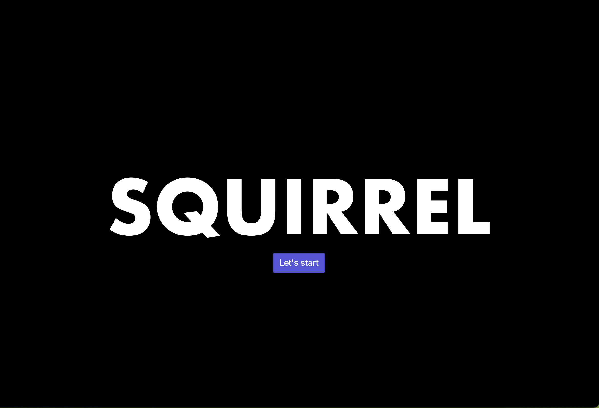
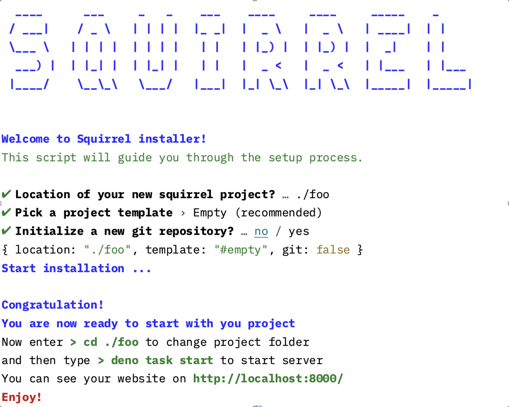
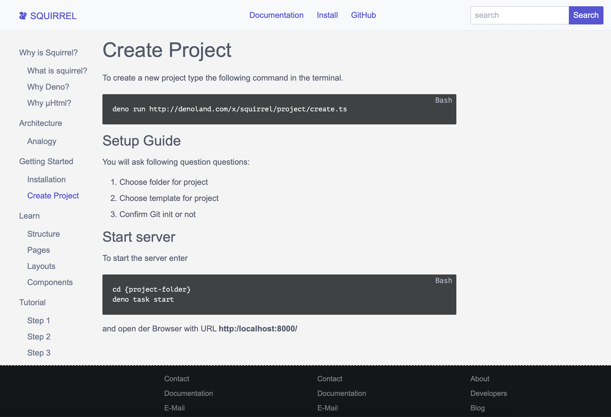
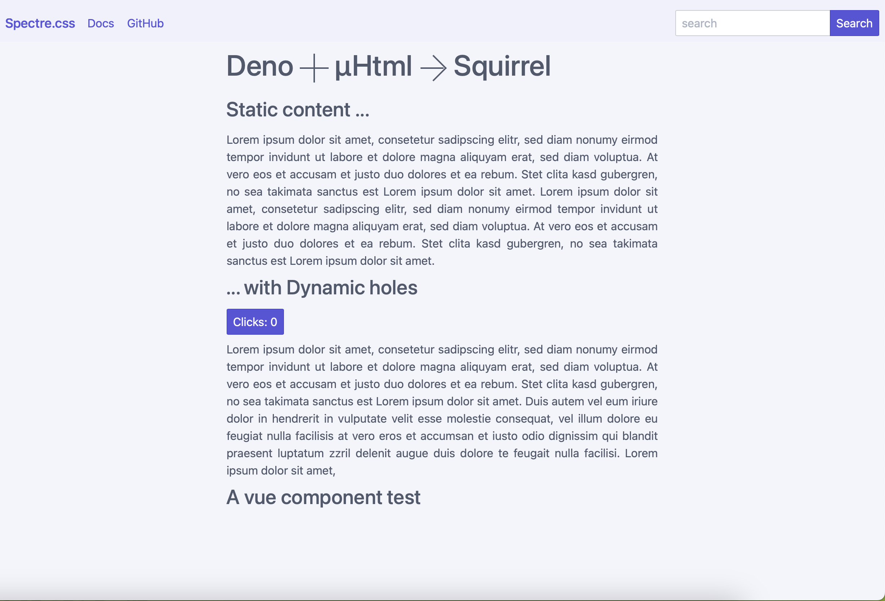
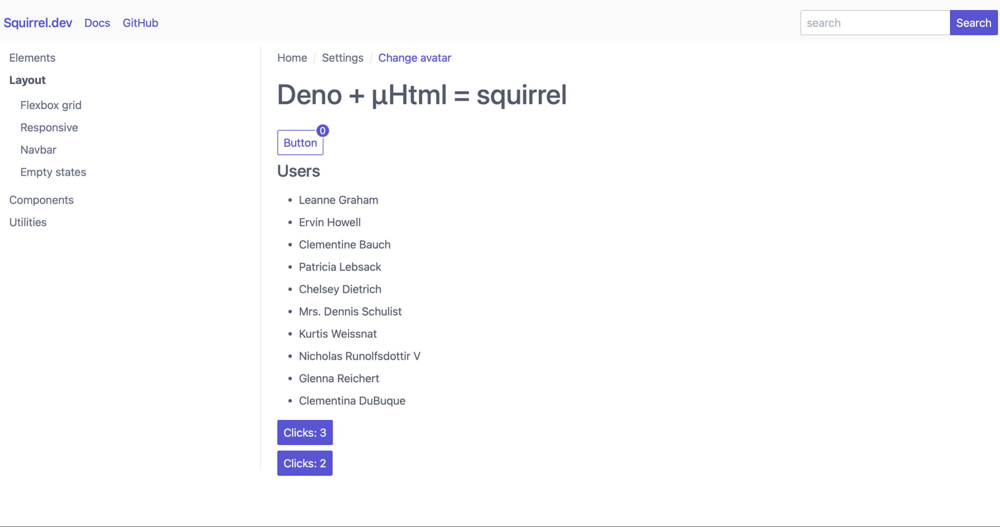

# SQUIRREL

A fast, simple and modern 7th generation framework similar to [Astro](https://astro.build) but less complicated.

## Why fast?

It is fast because it is build with Deno and uHtml.

## Why simple?

It is simple made.

## Why modern?

It is modern, because it uses state of the art ideas.

# Installer

# Documentation

# Demo Homepage

